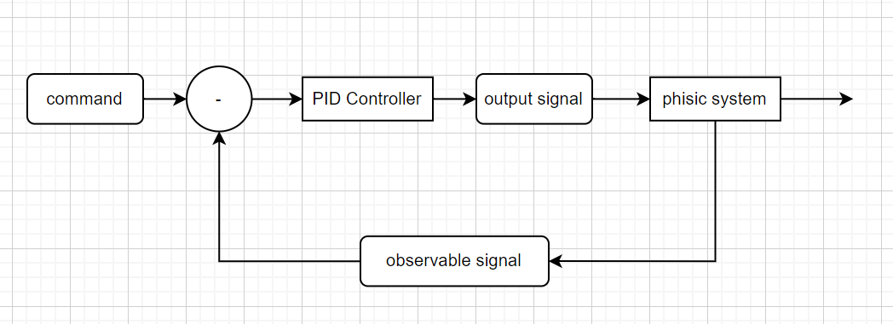

# PIDController
##### A simple module for PID control in Python


___
1. Installation  
`pip install pidcontroller`
___
2. Topo Structure  

___
1. Usage [example.py](./example.py)

```
from pidcontroller import Variable, PIDController
import time
if __name__ == "__main__":
    # defination of command signal
    # eg. the destination of robot
    V_input = Variable(name="input")

    # defination of output signal
    # eg. the valtage command passed to motor
    V_output = Variable(name="output")

    # defination of observable signal
    # eg. the position captured by sensor
    V_observable = Variable(name="observable")

    # initialization of controller
    controller = PIDController(
        p=1e-1,
        i=1e-1,
        d=1e-1,
        input=V_input,
        output=V_output,
        observable=V_observable)

    # estimation of real system
    @controller.observable_observe
    def sysEstim(x):
        # define how the estimated system works
        ...
        return x

    # input command
    @controller.input_observe
    def makeInput(x):
        # setup/change input command
        return x

    # start calculation
    # set initial command = 10
    makeInput(10)

    # loop for 100 times
    for i in range(100):
        time.sleep(0.01)
        sysEstim(V_output.value)
    # visualization of simulation
    controller.visualize()
```
  
____
1. Visualisation  
</img>